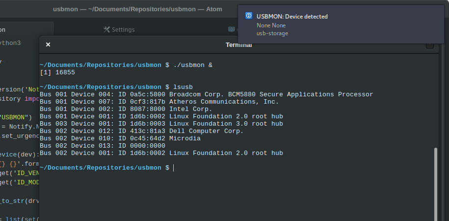

# USBMON
USBMON is a small script to monitor when a USB device is put in and sends a notification including the loaded drivers for all interfaces.  
Therefore it might raise awareness if something phishy is going on.



## INSTALL
It runs on Gnome Shell on Ubuntu. Feel free to test and report.
USBMON is build on pyudev:

```sh
sudo apt install python3-pyudev
```

To start USBMON at login,
start `gnome-session-properties` and add `usbmon` to the startup applications.

